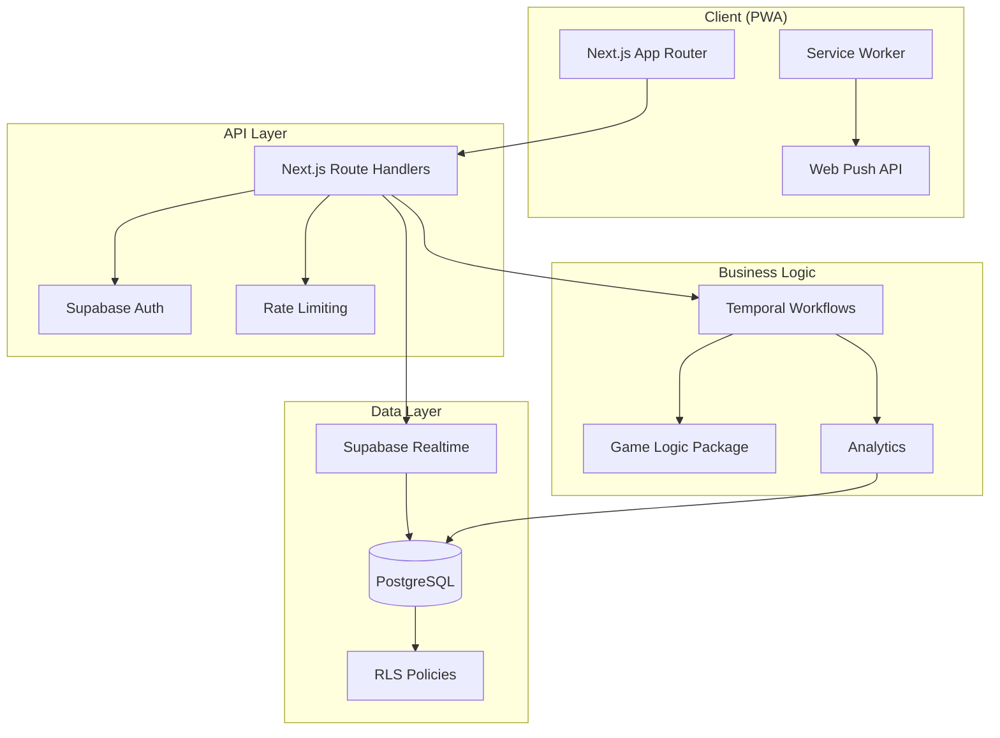

# Castaway Council Architecture

## System Overview

Castaway Council is a real-time, slow-burn social survival RPG built as a Progressive Web App (PWA). The system orchestrates game phases using Temporal Workflows, maintains state in PostgreSQL via Supabase, and delivers real-time updates via WebSockets.

## Architecture Diagram

## Core Components

### 1. Frontend (PWA)
- **Framework**: Next.js 14 with App Router
- **State Management**: React Query + Zustand
- **Styling**: Tailwind CSS
- **Offline Support**: Service Worker with caching
- **Push Notifications**: Web Push API (VAPID)

### 2. Backend API
- **Framework**: Next.js Route Handlers
- **Validation**: Zod schemas
- **Authentication**: Supabase Auth
- **Rate Limiting**: In-memory store (production: Redis)

### 3. Database
- **Engine**: PostgreSQL
- **ORM**: Drizzle
- **Access Control**: Row Level Security (RLS)
- **Realtime**: Supabase Realtime subscriptions

### 4. Orchestration
- **Engine**: Temporal
- **Workflows**: Season phase management
- **Activities**: Challenge scoring, vote tallying, merge logic

### 5. Game Logic
- **RNG**: Commit-reveal protocol (HMAC-SHA256)
- **Scoring**: Energy bonuses, item modifiers, debuffs
- **Verification**: Reproducible from published seeds

## Data Flow

### Phase Transition Flow

1. Temporal Workflow schedules phase end timer
2. Timer fires → Activity emits phase_close event
3. Event written to DB → Triggers Supabase Realtime
4. Clients receive update → UI updates phase state
5. Push notifications sent to subscribed users

### Challenge Resolution Flow

1. Phase: Challenge commit opens
2. Clients POST `/api/challenge/commit` with seed hash
3. Phase: Challenge closes, commits locked
4. Temporal Activity calls `/api/challenge/score`
5. Server generates server seed, calculates rolls
6. Results stored, events emitted
7. Public log shows seeds + transcript for verification

### Voting Flow

1. Phase: Vote opens
2. Clients POST `/api/vote` with target
3. Idols can be played (prevents vote)
4. Phase: Vote closes
5. Temporal Activity tallies votes
6. Ties handled: revote or fire-making challenge
7. Eliminated player marked, votes revealed

## Security

### Row Level Security (RLS)

- **Messages**: Tribe/DM/Public channels isolated
- **Votes**: Private until revealed_at timestamp set
- **Confessionals**: Private default, postseason visibility option
- **Players**: Season participants can see peers

### Authentication

- Supabase JWT tokens in HTTP-only cookies
- Session validation on all API routes
- Player ID derived from user session

### Rate Limiting

- Message sending: 10 messages per 30 seconds per channel
- Applied at middleware layer before DB writes

## Realtime Channels

### Channel Structure

- `season:{seasonId}:public` - Public log, events, phase changes
- `tribe:{tribeId}:chat` - Tribe chat messages
- `dm:{pairKey}` - Direct messages (pairKey = sorted player IDs)

### Presence

- Players show presence on tribe channels
- Indicates who's online/active

## Temporal Workflows

### SeasonWorkflow

**Input**: `{ seasonId, totalDays, fastForwardEnabled }`

**Loop** (per day):
1. Open Camp Phase (8h normal / 5min fast-forward)
2. Open Challenge Phase (8h / 5min)
3. Score Challenge (activity)
4. Open Vote Phase (6h / 3min)
5. Tally Votes (activity)
6. Check Merge (day 10)
7. Emit Daily Summary

**Idempotency**: Events table acts as ledger with unique constraints

## Performance Considerations

- **Caching**: Static assets via service worker
- **Database Indexes**: On foreign keys, frequently queried fields
- **Connection Pooling**: Postgres connection pool configured
- **WebSocket Limits**: Supabase Realtime connection limits managed

## Deployment

### Docker Compose Stack

- PostgreSQL (main DB)
- Supabase Postgres (with RLS)
- Temporal Server
- Next.js Web App

### Environment Variables

See `.env.example` for required configuration:
- Database URLs
- Supabase keys
- Temporal address
- VAPID keys for push

## Testing Strategy

1. **Unit Tests**: Game logic, RNG verification, utilities
2. **Integration Tests**: API routes, RLS policies, Realtime channels
3. **E2E Tests**: Fast-forward season simulation with bots
4. **CI Pipeline**: Runs all tests on push/PR

## Monitoring & Analytics

- **Metrics**: DAU, messages/user/day, vote participation, phase on-time %
- **Audit Log**: Moderation actions, admin operations
- **Season Recap**: CSV export with full statistics
